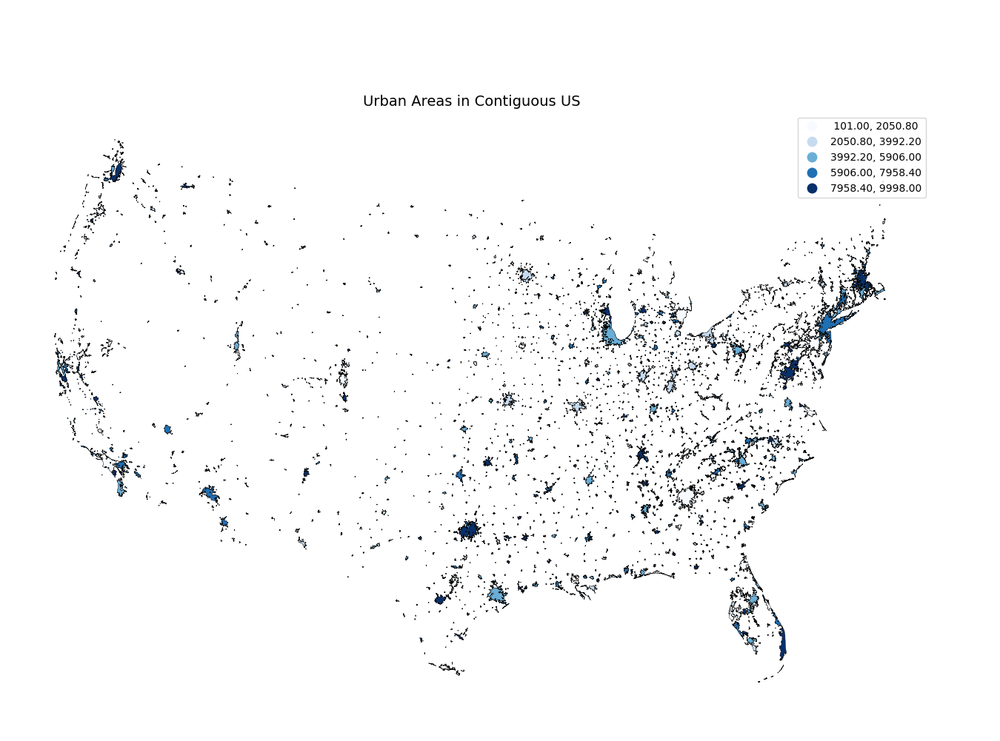

# Spring25-asv-antonrasmussen-public


To run maps_week11_bonus_points code:
```
python3 -m venv venv
source venv/bin/activate
pip install geopandas pysal mapclassify
cd maps_week11_bonus_points
python ./maps_week_11_bonus_points_exercise.py
```

